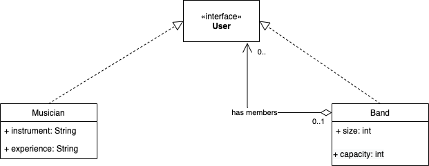
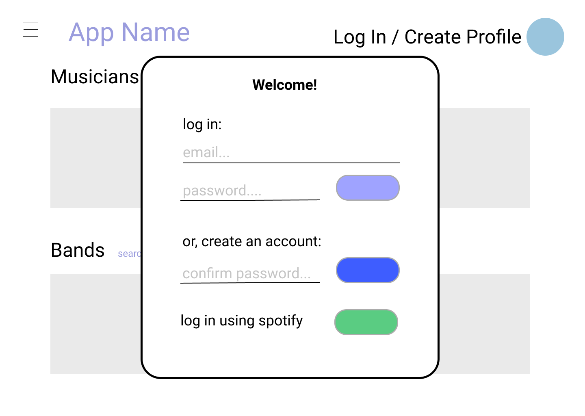
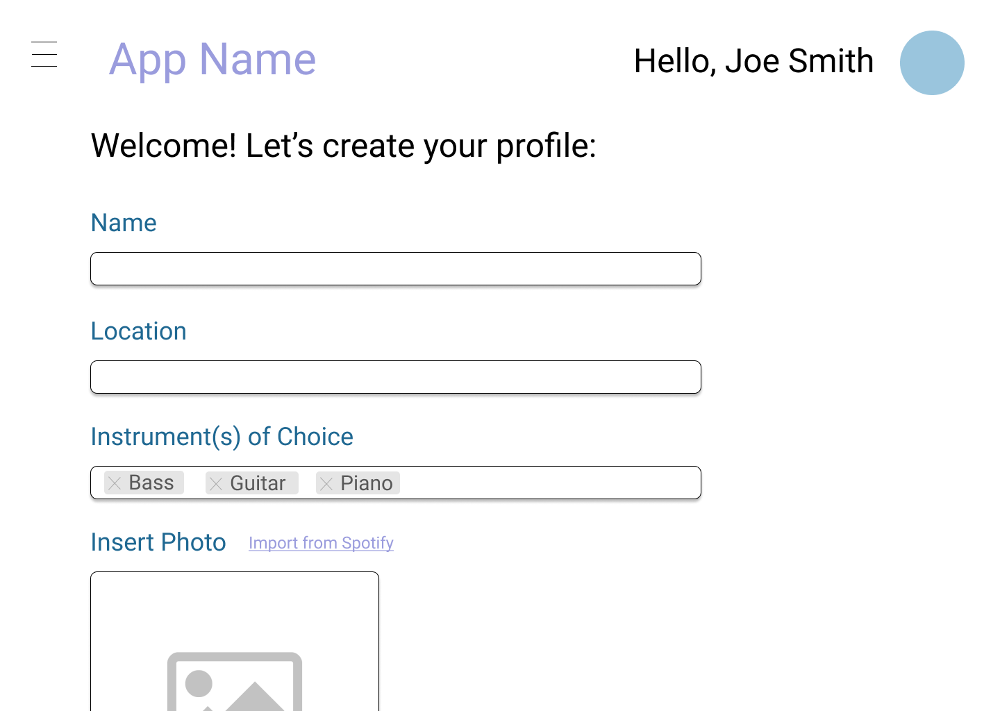
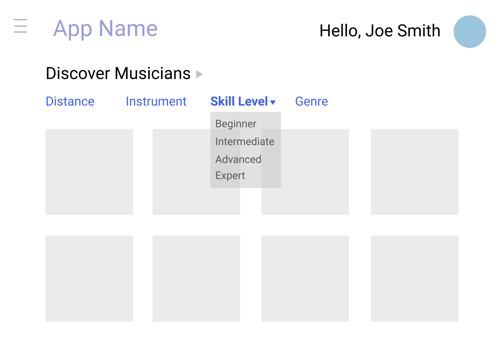

# Teamwork
Team Lead - Ramchandran Muthukumar

[Team Availability](https://www.when2meet.com/?11153087-BLSdS)

# OO Design

# Wireframe & Use-case

Use Case: Browse on Homepage
1. The user visits our web application using a web browser.
2. The user lands on the homepage and is invited to browse through musicians and bands suggested by our app.
3. Clicking on a user/band icon will redirect them to the chosen profile page.
4. Clicking on "Search by Category" will redirect them to the advanced search page.

Use Case: Signing Up
1. A user will click on the "Log In/Create Profile", and a pop up box will appear.
2. The user can log in to our app using their previously created credentials or through Spotify.
3. The user has the option to create a new account.

Use Case: Advanced Search
1. Through the "Advanced Search" page, a user can click on a category filter along the top of the page to narrow down their results.
2. As a user updates their preferences using the filters, the suggested profiles will update.

Use Case: Creating a Profile
1. Once redirected to the "Creating a Profile" page, a user will enter their information to complete their profile.
2. A user has the option to link their Spotify information such as profile picture, name, and music preferences to their profile.

# Iteration Backlog
- As a user, I would like to be able to use my Spotify account for single sign-on so I can display portions of my listening history on my profile.
- As a user, I want to be able to create a visible profile with my name, instrument, experience level, and musical taste so that I can meet people with similar interests.
- As a band member, I want to be able to create a profile on the app for my band so that we can easily search for additional musicians as a single entity.

# Tasks
- Setup technology stack
- Design UML class diagrams for implementing User Stories
- Design Wire-frames for 
  1. Landing Page
  2. Post-login User dashboard
- Test and Deploy. 

# Retrospective
