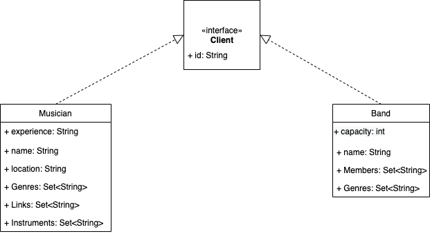
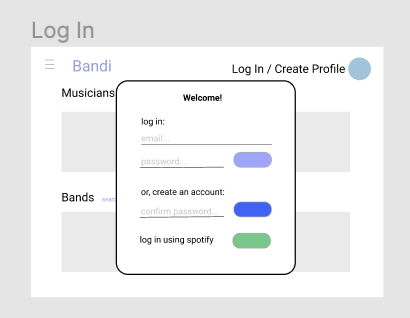
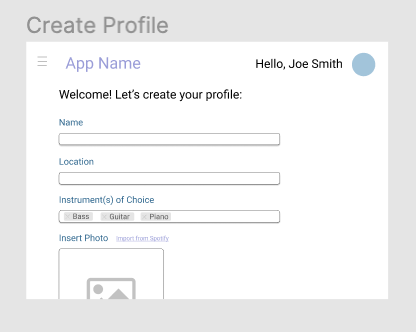
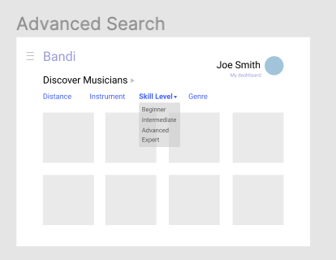

# Teamwork
Team Lead - Stefano Tusa Lavieri

[Team Availability](https://www.when2meet.com/?11290451-mUIJw)
[Team Availability Week 2](https://www.when2meet.com/?11359694-vE2hQ)

# OO Design

# Wireframe & Use-case

Use Case: Using Advanced Search 
1. A user accessing the Bandi homepage lands on the Discover page, where they can see different tiles representing users and bands in a given area.
2. Deciding to narrow down the pool of options, the user clicks on the Advanced Search option.
3. A list of criterion appears on the left side of the screen, similar to a shopping interface, and musicians / bands appear to the right as cards; appearing and disappearing as 
   different filters are selected and applied.
5. If a user is logged in, clicking on a card will show the user's publicly visible profile information.

Use Case: Adding a Soundcloud or YouTube link to a User Profile
1. As part of the Edit Profile screen, a user now has the option to add a link to YouTube or Soundcloud performances, mediated through their respective APIs.

Use Case: Creating a Band Entity
1. A user on the Bandi site pulls up their profile dashboard.
2. They click "Create a Band". A form pops up asking them to enter some basic details about their band, and once they hit "Create" they can see their band displayed on their dashboard.
3. Clicking the band pulls up the basic details entered by the user at the time of creation. This information can be edited at any time by clicking the "Edit" button.
4. On this same view, a user can select to invite users to join their band. By entering their display name or email, prospective band members will receive a notification request to accept or decline the user's request. Once prospective users have accepted the request, both users will now have access to the shared Band object, which now shows the updated band roster.

# Iteration Backlog
- As a band member, I want to be able to create a profile on the app for my band so that we can easily search for additional musicians as a single entity.
- As a user, I want to be able to filter profiles based on a set of similar interests and/or geographic proximity to me so that I can connect with those users.
- As a band member, I want to be able to link my and my bandmates' personal profiles to the band profile so that prospective musicians can easily learn about the band and its members.
- As a user and as a band member, I would like to be able to put links to audio/video clips (YouTube, Soundcloud, etc.) on my profiles so I can give prospective collaborators a preview of my playing.

# Tasks
- Design UML class diagrams for implementing User Stories
- Design wireframes for 
  1. Post-login user dashboard 
  2. Band view / tab on profile
  3. Advanced search page
- refactor backend database to allow for multi-valued attributes (break down into more tables)
- update BandDao, MusicianDao, Musician and Band classes to accomodate the database
- store user id at login and access the user's identifier throughout the components using a cookie
- implement the my profile view, with tabs for my profile and my bands
- implement search / filter for musicians
- implement a browsing page for musicians and for bands, and allow for a full screen view of any individual band / musician profile
- add more style to the frontend
- Test and Deploy

# Retrospective

#### What we have done
- Built backend API, implemented functionality for MusicianDao and BandDao operations. Several new tables were introduced in order to efficiently store multi-variate attributes of Musicians and of Bands
- Implemented Spotify authentication, obtaining the name from Spotify user data and storing it with unique id in the database
- Built several frontend components (edit profile, discover page, my profile, create band, sign in, band browse, musician browse, band profile (other user), msuciian profile (other user))
- added searching functionality for musician profiles
- Created numerous functioning get requests to populate our views with up-to-date user data
- Introduced a nav bar and other UI /UX components to make using our app a more pleasant experience

#### What we haven't done
- Post and put requests to update the data are attempted, but not functioning, due to being blocked by CORS (even in deployment, adding to our header is not allowing us to make these types of requests)
- Reversibility in terms of deleting data after creation is not yet implemented

#### Difficulties
- Building the backend at the same time as frontend is a complicated process since they are highly dependent on each other
- Linking the frontend with the backend is difficult, especially with CORS issues frequently interfering with testing/development
- Passing authentication information in a way that avoids relying on query parameters.

#### Looking forward
- We must eventually figure out how to get our post and put requests to work (resolve the error from CORS)
- We hope to find a more secure way of passing the unique ID from Spotify to the frontend in order to keep the current user logged in

