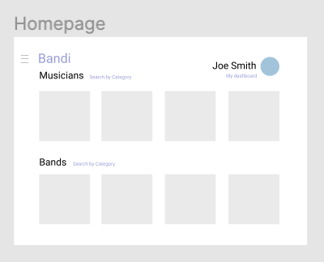
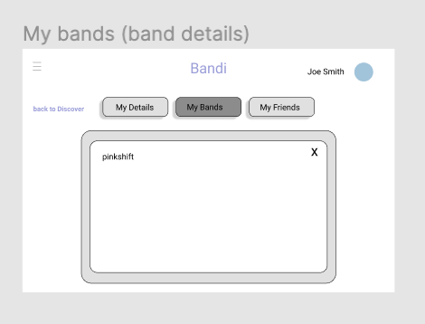

# Teamwork
Team Lead - Stefano Tusa Lavieri

[Team Availability](https://www.when2meet.com/?11290451-mUIJw)

# OO Design

# Wireframe & Use-case

Use Case: Using Advanced Search 
1. A user accessing the Bandi homepage lands on the Discover page, where they can see different tiles representing users and bands in a given area.
2. Deciding to narrow down the pool of options, the user clicks on the Advanced Search option.
3. A list of criterion appears on the left side of the screen, similar to a shopping interface, and musicians / bands appear to the right as cards; appearing and disappearing as 
   different filters are selected and applied.
5. If a user is logged in, clicking on a card will show the user's publicly visible profile information.

Use Case: Adding a Soundcloud or YouTube link to a User Profile
1. As part of the Edit Profile screen, a user now has the option to add a link to YouTube or Soundcloud performances, mediated through their respective APIs.

Use Case: Creating a Band Entity
1. A user on the Bandi site pulls up their profile dashboard.
2. They click "Create a Band". A form pops up asking them to enter some basic details about their band, and once they hit "Create" they can see their band displayed on their dashboard.
3. Clicking the band pulls up the basic details entered by the user at the time of creation. This information can be edited at any time by clicking the "Edit" button.
4. On this same view, a user can select to invite users to join their band. By entering their display name or email, prospective band members will receive a notification request to accept or decline the user's request. Once prospective users have accepted the request, both users will now have access to the shared Band object, which now shows the updated band roster.

# Iteration Backlog
- As a band member, I want to be able to create a profile on the app for my band so that we can easily search for additional musicians as a single entity.
- As a user, I want to be able to filter profiles based on a set of similar interests and/or geographic proximity to me so that I can connect with those users.
- As a band member, I want to be able to link my and my bandmates' personal profiles to the band profile so that prospective musicians can easily learn about the band and its members.
- As a user and as a band member, I would like to be able to put links to audio/video clips (YouTube, Soundcloud, etc.) on my profiles so I can give prospective collaborators a preview of my playing.

# Tasks
- Design UML class diagrams for implementing User Stories
- Design wireframes for 
  1. Post-login user dashboard 
  2. Band view / tab on profile
  3. Advanced search page
- Test and Deploy.

# Retrospective

#### What we have done
- Built backend API, implemented functionality for `Musician` operations.
- Implemented Spotify authentication.
- Built several frontend components (edit profile, discover page)

#### In Progress
- Front-end styling to fully support the wireframes. 
- Front-end browsing feature for bands and musicians. 

#### What we haven't done
- Basic API to service CRUD operations for `Band`.
- React app components to provide profile view of `Band` and `User`
- Unit-testing and Documentation of API. 

#### Difficulties
- Building backend at the same time as front end was not ideal.
- Integration of frontend with backend.
- Passing authentication information in a way that avoids using query parameters.

#### Looking forward

