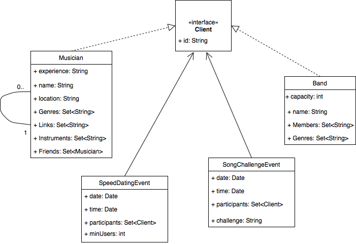
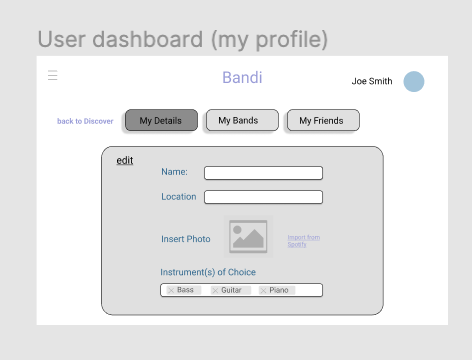
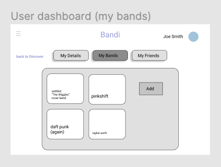
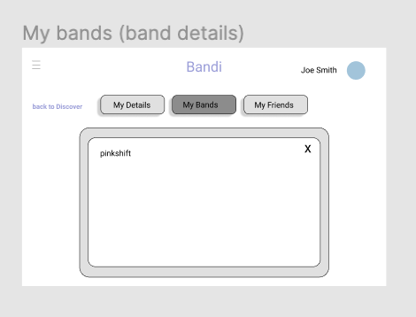

# Teamwork
Team Lead - Matthew Ost

[Team Availability](https://www.when2meet.com/?11411729-tWIoL)

# OO Design

# Wireframe & Use-case

User case: Adding a connection

1. A user browses through the profiles of other musicians/bands and selects one to view in more depth.
2. The user clicks the "Connect" button and waits for the request to be accepted by the other user.
3. Once accepted, the two users can create a chat.

Use Case: Chatting with a connection

1. A user clicks a link on the navigation bar that directs them to a page where they can see all existing conversations in their chat inbox.
2. For a new chat, the user clicks a create button and selects another user with whom they would like to chat. For an existing chat, the user selects the existing conversation in their inbox.
3. A chat window with a text box and some basic controls appear. If applicable, the window is populated with messages from previous conversations with the same connection.
5. The user types and sends a message.

Use Case: Creating song-of-the-week challenges
1. An admin creates a new "event" inviting A/V submissions from the user. 
2. Once the USER logsin, his/her dashboard has a tab/jumbotron with a button "Explore Song-of-the-week" 
3. Clicking the button redirects to a new component view. A column in the left with a week reference - 'current week' or 'Sun X, 20** - Sat Y, 20**' and choosing an appropriate week gives a blurb on the right with a description of the song-of-the-week choice. 
4. The user observes a few candidate submissions and finally has the option to submit their own A/V link with tags on instrument and experience. 

Use Case: Creating a speed-dating event
1. An admin creates a new speed-dating event, setting the date, time, number of participants, and geographic eligibility.
2. Users browse the "Events" section to find matching events.
3. Once an event is found, a user can click register and will receive a confirmation email.

# Iteration Backlog
- As a user, I want to be able to save the profiles of people I meet in the app so that I can connect with them later.
- As a user, I want to be able to chat with other users that I connect with so that we can discuss our tastes, see if we are a good fit, and arrange to meet in person without having to exchange personal contact information.
- As an admin, I want to create speed-dating-like events to send participants into different chatrooms (zoom) where they can chat for a short amount of time before moving on to the next chosen match, so that users can have a fun way of meeting a lot of people in a short amount of time.
- As an admin, I want to set the time and date of speed-dating events, as well as the minimum number of users that must register themselves for an event before the virtual chatrooms are opened/created, to ensure that events will have a good user turnout.
- As an admin, I want to create "song-of-the-week" events that chooses a song high in the latest charts. The event has description or information about the song and an option for users to submit youtube/soundcloud links (capped to 1-2 mins)

# Tasks
- Design UML class diagrams for implementing User Stories
- Design wireframes for
  1. Chat window
  2. Speed-dating event creation page for admins
  3. Song-of-the-week challenge creation page for admins
  4. Song-of-the-week submission page for musicians
- Create an admin user role
- Update the database and add routes to support connections between users
- Add models, DAO methods, and update the database to support speed-dating and song-of-the-week
- Research external tools to faciliate quick development of chat functionality
- Add more styling
- Test and Deploy

# Retrospective

#### What we have done
#### What we haven't done
#### Difficulties
#### Looking forward

