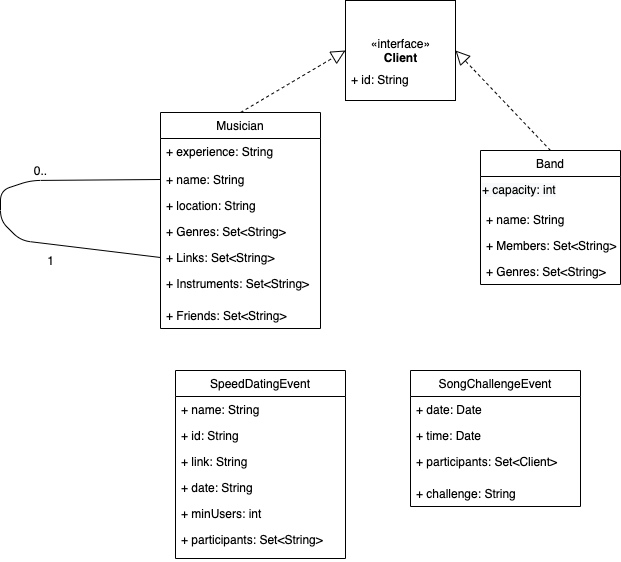
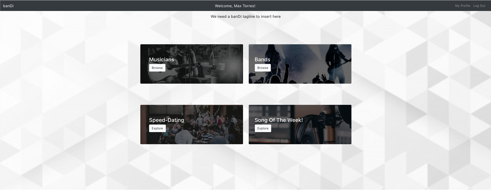
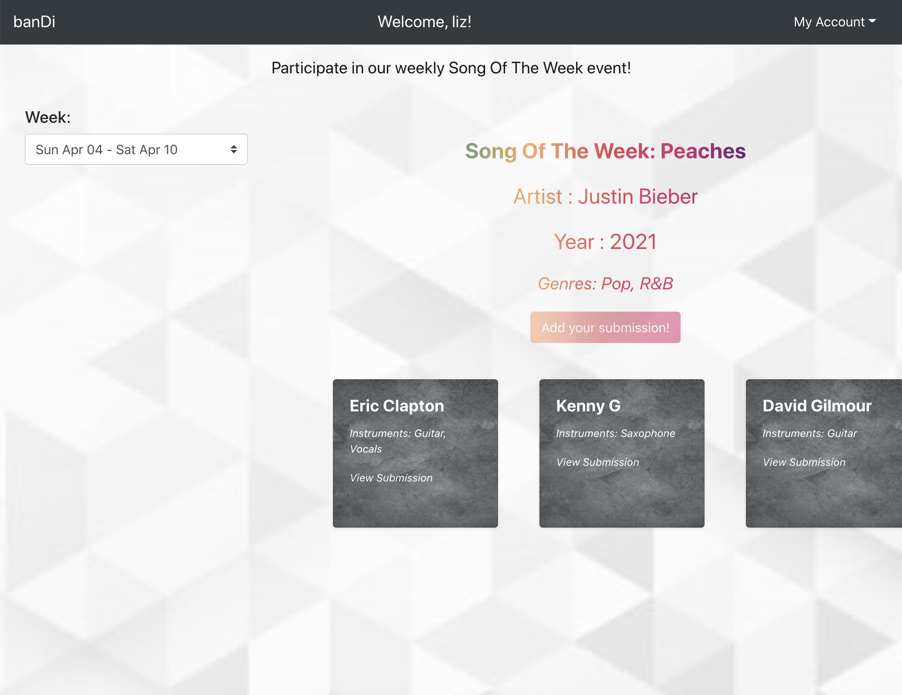
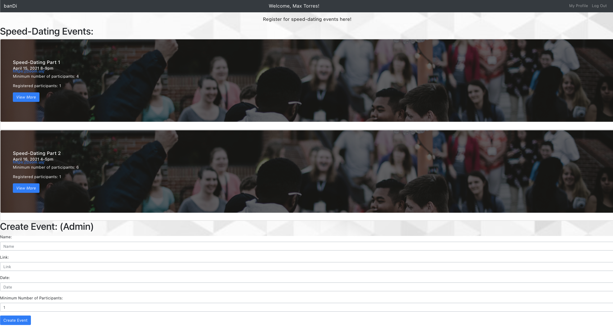
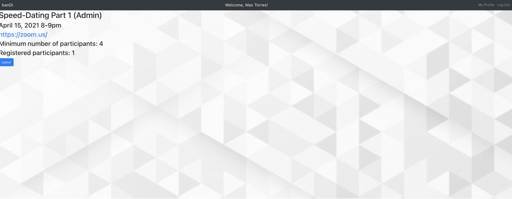

# Teamwork  
Team Lead - Elizabeth Aguirre

[Team Availability](https://www.when2meet.com/?11552488-qjqrX)

# OO Design

# Wireframe & Use-case

Use Case: Using Advanced Search
1. A user accessing the Bandi homepage lands on the Discover page, where they can see different tiles representing users and bands in a given area.
2. Deciding to narrow down the pool of options, the user clicks on the Advanced Search option.
3. A list of criterion appears on the left side of the screen, similar to a shopping interface, and musicians / bands appear to the right as cards; appearing and disappearing as different filters are selected and applied.
4. If a user is logged in, clicking on a card will show the user's publicly visible profile information.

Use Case: Making a song-of-the-week challenge submission  
1. A user navigates to the Song of the Week page.
2. The user is presented with the song of the week and the current submissions.
3. If they click on another user's submission, they will be redirected to the submission link.
4. If they click on "Add your submission!", they will be prompted to post their submission link.

Use Case: Updating a speed-dating event 
1. After an admin creates a new "event" inviting A/V submissions from the user. 
2. As an admin, you have the option to click on "Manage Event" to edit the details of the event, such as the number of possible registrations.
3. An admin can also view who has currently RSVP'ed to the event.

User Case: Invite to Band
  1. A user browses through the profiles of other musicians and selects one to view in more depth.
  2. The user clicks the "Invite to Band!" button and waits for the request to be accepted by the other user.
  3. Once accepted, the invited user will display as a member of the band.

# Iteration Backlog
- As a user, I want to be able to browse and register for speed-dating events that are happening in my area so that I can quickly meet a lot of people with similar interests and see if we might be a good match.
- As a user, I want to browse song-of-the-week events by genre and make submissions.
- As a band member, I want to be able to send an invite to other registered users to join my band profile.  

Postponed:
- As a student user, I would like to verify my college enrollment with an .edu email so I can filter and find other students on my campus and at nearby schools.
- As an admin, I want to enable RSVP functionality for the speed-dating events and set visibility to all registered users, so that only registered users can attend the events.

# Tasks
- Design UML class diagrams for implementing User Stories
- Design wireframes for:  
  1. Save-for-later feature
  2. Invite to band feature
- Set up chat rooms for speed dating events
- Continue improving friend features
- Continue improving frontend styling
- Test and Deploy

# Retrospective
#### What we have done

#### What we haven't done

#### Difficulties

#### Looking Forward
